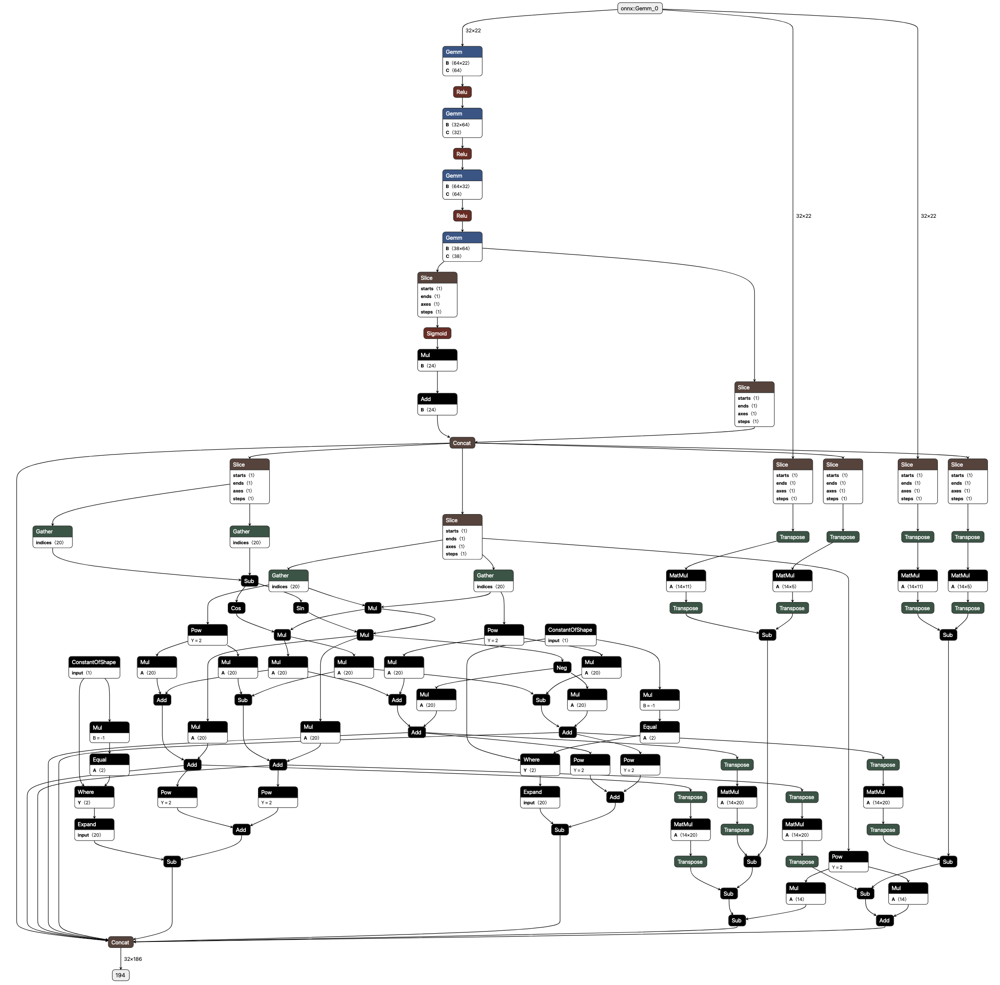

# Benchmark

## Environment Setup
To set up the environment, follow these steps:
1. Create the environment using the command: `conda env create -f env.yaml`
2. Activate the environment using the command: `conda activate onnx-vnnlib-env`

---
The benchmark files are located in the `onnx` and `vnnlib` folders:

To reproduce vnnlib files, run: `python generate_properties.py --seed=42`

## Vnnlib description
### Input:
+- 5% perturbation of the reference active and reactive load + random noise between -1% and 1%
### Output:
Check power balance violation:

for each bus `i`
- `|p_balance[i]| <= max(10^(-3), 10^(-2)*pd_i)`
- `|q_balance[i]| <= max(10^(-3), 10^(-2)*qd_i)`

where `pd_i` and `qd_i` refer to the active and reactive load at each bus respectively.

---
## Inference
The code to run inference is presented in the `main.py` file.

## Example
Take 14-bus system as an example:
- onnx file: `ldf14bus.onnx`
- vnnlib file: `14_bus_prop1.vnnlib`

### Parameters
- N = 14 : number of buses
- G =  5 : number of generators
- L = 11 : number of loads
- E = 20 : number of lines
---
### Onnx model description
NN with bound clip and residual calculation.
#### Input: `pd/qd`
dim: (2L) = 22
- `pd`: Real power demand. (L)
- `qd`: Reactive power demand. (L)
#### Output: `pg/qg/vm/va/pf/pt/qf/qt/thrm_1/thrm_2/p_balance/q_balance`
dim: (2G + 4N + 6E) = 186
- `pg`: Real power generation. (G)
- `qg`: Reactive power generation. (G)
- `vm`: Voltage magnitude. (N)
- `va`: Voltage angle. (N)
- `pf`: Real power flow from. (E)
- `pt`: Real power flow to. (E)
- `qf`: Reactive power flow from. (E)
- `qt`: Reactive power flow to. (E)
- `thrm_1`: Thermal limit from residual. (E)
- `thrm_2`: Thermal limit to residual. (E)
- `p_balance`: Real power balance residual. (N)
- `q_balance`: Reactive power balance residual. (N)

#### Compute graph
